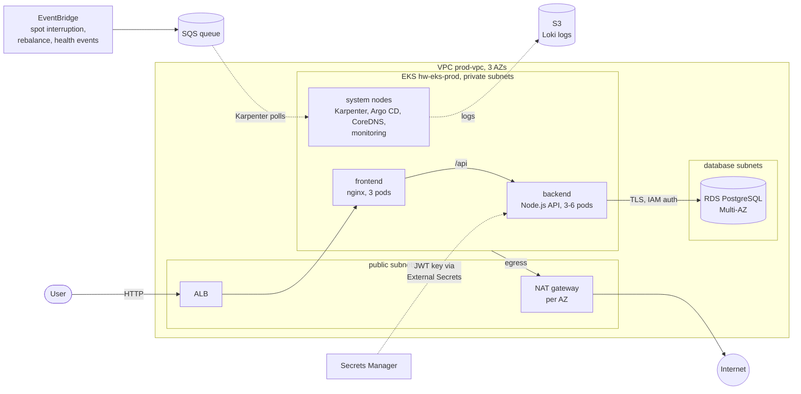
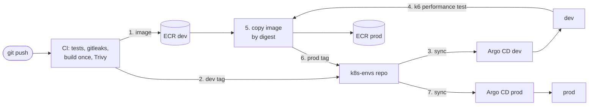

# Conduit on AWS: infrastructure

Production-style AWS platform for the [RealWorld "Conduit"](https://github.com/jelicki-jovan/Incode-conduit-realworld-example-app)
app (React frontend, Node.js/Express API, PostgreSQL): EKS, RDS, GitOps with Argo CD, all AWS resources
defined in Terraform. Built as the Incode DevOps take-home task.

Two environments, **dev** and **prod**, each with its own VPC, EKS cluster and database. Dev exists to
**separate the environments** and for the **release flow**: every change lands there first and passes a
performance test before the same image goes to prod.

## At a glance

| Area | What |
|---|---|
| Environments | dev + prod, separate VPCs, clusters and databases; dev is a reduced copy (single NAT, 2 system nodes, single-AZ database, spot only, no monitoring) |
| Compute | EKS 1.36 in 3 AZs; managed **system** node group for cluster add-ons + **Karpenter** for app nodes (spot + on-demand) |
| Data | RDS PostgreSQL 17, Multi-AZ, encrypted, TLS enforced; the app logs in with **IAM auth** (no DB password) |
| Delivery | GitHub Actions (tests, secret scan, image scan, build once) → dev → **performance test (k6)** → the same image promoted to prod; **Argo CD** (GitOps) in each cluster |
| Security | No long-lived AWS keys (GitHub OIDC, IRSA, Pod Identity), app logs in to the DB without a password, secrets in Secrets Manager + External Secrets (never in Git), private subnets, least-privilege roles |
| Observability | Prometheus + Grafana, Loki (logs in S3), CloudWatch; alerts to email via SNS, incl. a dead man's switch |
| Backups | RDS point-in-time restore (7 days), daily EBS snapshots (DLM), S3 versioning |
| IaC | Terraform, remote state in S3 with native locking, one stack per account level / environment |

## Architecture

- A request hits the **ALB** (created by the AWS Load Balancer Controller from the frontend's Ingress), which
  sends it straight to the **frontend** pods (nginx serving the React build). nginx proxies `/api/*` to the
  **backend** Service inside the cluster; the backend has no public entry point of its own.
- The backend talks to **RDS** over verified TLS, as a least-privilege `app_user`, with a 15-minute IAM token
  from its pod's IAM role instead of a password.
- **Nodes**: a small managed node group (tainted, system add-ons only) keeps the cluster itself running;
  **Karpenter** launches app nodes on demand, mixing spot and on-demand, spread over 3 AZs. AWS's 2-minute
  spot interruption warnings (and rebalance / maintenance events) reach Karpenter through EventBridge and an
  SQS queue, so it starts a replacement node and drains the old one before AWS takes it back.
- **Network**: public subnets only for the ALB and NAT gateways; nodes in private subnets; RDS in isolated
  database subnets reachable only from the EKS nodes. One NAT gateway per AZ (an AZ outage doesn't cut egress).

The diagram shows prod. Dev has the same shape, smaller: its own VPC (`10.2.0.0/16`) with one NAT gateway,
2 system nodes, a single-AZ database, spot-only app nodes and no monitoring stack.

## How the three repositories fit together

| Repository | Owns |
|---|---|
| [`Incode-conduit-realworld-example-app`](https://github.com/jelicki-jovan/Incode-conduit-realworld-example-app) | App code, Dockerfiles, CI (GitHub Actions) |
| **`terraform`** (this repo) | Everything in AWS + the cluster bootstrap (Karpenter, Argo CD), per environment |
| [`k8s-envs`](https://github.com/jelicki-jovan/k8s-envs) | Everything inside the clusters, synced by each cluster's Argo CD (apps, add-ons, monitoring) |

CI never gets cluster credentials: it pushes images and commits tags to `k8s-envs`; each cluster's Argo CD
pulls the change and rolls it out (database migrations first, as a Job, then a zero-downtime rolling
update). Every change is **built once** and deployed to dev; only after the **performance test** on dev
passes is the **same image** (verified by digest) copied to the prod repository and deployed to prod.
Details in the [app repo's README](https://github.com/jelicki-jovan/Incode-conduit-realworld-example-app).

## What's in this repo

| Folder | What | Details |
|---|---|---|
| `management/` | Account-level, shared by all environments: Terraform state bucket, ECR repositories (dev and prod), GitHub OIDC role for CI, EC2 Spot service-linked role | [README](management/README.md) |
| `environments/prod/` | The prod environment, one file per component: VPC, EKS, RDS, backend, frontend, monitoring | [README](environments/prod/README.md) |
| `environments/prod/platform/` | What runs on the cluster and bootstraps it: Karpenter, Argo CD | [README](environments/prod/platform/README.md) |
| `environments/dev/` (+ `platform/`) | The dev environment: a reduced copy of prod | [README](environments/dev/README.md) |
| `modules/` | Own modules (S3, ECR) with secure defaults | [README](modules/README.md) |
| `docs/` | Known gaps, runbooks | [known gaps](docs/known-gaps.md), [runbooks](docs/runbooks/) |

## Setup from zero

Prerequisites: an AWS account (region **us-east-1**: the account's SCPs allow no other region), Terraform
≥ 1.10, AWS CLI v2, kubectl.

1. **`management/`**: first apply with local state (the state bucket doesn't exist yet), then enable the S3
   backend and `terraform init -migrate-state`. Creates the state bucket, ECR repositories and the GitHub
   OIDC role.
2. **App repo CI**: the role ARN (output `github_actions_ecr_role_arn`) goes into the workflow
   (`app-ci.yml`; it isn't a secret). Create an SSH key pair: the public key as a **deploy key with write
   access** on `k8s-envs`, the private key as the GitHub Actions secret `K8S_ENVS_DEPLOY_KEY` in the app repo,
   and a password for the performance test user as the secret `PERF_USER_PASSWORD`.
3. **`environments/prod/`**: `terraform init && terraform apply`. Creates the VPC, EKS, RDS, secrets, IAM
   roles and monitoring storage, then installs Karpenter and Argo CD. Argo CD syncs `k8s-envs` and brings up
   everything else (add-ons, monitoring, the apps).
4. **Second `terraform apply`** once Argo CD has created the ALB: adds the ALB alarms (the ALB is created by
   Kubernetes, not Terraform).
5. **Alerts**: subscribe an email to the SNS topic `hw-alerts-prod` and confirm it (kept out of the code on
   purpose: no personal address in a public repo).
6. **`environments/dev/`**: the same way (its own state); the dev cluster's Argo CD syncs
   `k8s-envs/argocd/dev`.

Access: `aws eks update-kubeconfig --name hw-eks-prod --region us-east-1` (dev: `hw-eks-dev`); Argo CD and Grafana are reached
with `kubectl port-forward` (no public UIs). Step-by-step details are in the folder READMEs.

Rebuilding in another account needs a few values changed: the EKS admin (access entry), the account ID and
role ARNs referenced in `k8s-envs` and in the app repo's workflow, and the RDS endpoint/secret name.

## Key decisions

- **GitOps with separate repos**: app, infrastructure and cluster state are versioned and reviewed
  separately; CI has no cluster access. Trade-off: a deploy is two commits (image + tag bump).
- **System node group + Karpenter**: the cluster's own add-ons never depend on nodes Karpenter creates;
  apps get fast, cheap scaling with spot, while spread rules keep ≥ 1 replica per AZ and on on-demand.
- **As few long-lived credentials as possible**: no AWS keys anywhere (IRSA/Pod Identity for pods, OIDC for
  CI), no database password for the app (IAM auth). The secrets that remain (JWT signing key, RDS master
  password used only by migrations, the CI deploy key for `k8s-envs`) live in Secrets Manager or as an
  encrypted GitHub Actions secret, never in Git or in Terraform state.
- **Self-hosted monitoring** (Prometheus, Grafana, Loki) instead of the managed services: Amazon Managed
  Grafana needs IAM Identity Center, which this account doesn't have. CloudWatch still covers the AWS side
  and alerts that must work even if the cluster is down.
- **Frontend in the cluster (nginx), not S3 + CloudFront:** the task is about running the app on Kubernetes,
  so both parts run there with one delivery path (images + GitOps) instead of splitting the frontend off.
  The usual alternative for a static React app would be S3 + CloudFront with `/api/*` routed to the backend.
- **Explicit folders per environment**: dev is a copy of prod with its differences written directly in the
  code (no shared variables layer), so each environment can be read on its own. Trade-off: a change to a
  shared part is made in both folders; the standardized building blocks are modules.
- **Built within the account's guardrails**: one region, small instance types only, no AWS Backup →
  backups with RDS automated backups + Data Lifecycle Manager instead.

## HTTPS and the app's URL

The app is served over **plain HTTP** on the ALB's AWS hostname, and the URL is **deliberately not in this
public repository**.

**Why no HTTPS:** a trusted certificate needs a domain I control. AWS (ACM) can't issue one for the ALB's
`*.elb.amazonaws.com` name, and a self-signed certificate would only produce browser warnings. Registering a
domain inside the provided AWS account would mean billing that account and putting personal registrant
details into it, so I didn't.

**How it would be done:**

- **With a domain (production way):** Route 53 hosted zone + ACM certificate (DNS validation); the Ingress
  gets the certificate, an HTTPS listener and an HTTP → HTTPS redirect. The same for dev with its own
  subdomain.
- **Without a domain:** CloudFront in front of the ALB gives a valid `https://…cloudfront.net` address with
  AWS's certificate: static files cached according to nginx's `Cache-Control`, `/api/*` never cached with
  the JWT forwarded. Limits: CloudFront → ALB stays HTTP, and the ALB must accept traffic only from
  CloudFront (AWS's CloudFront prefix list) so nobody bypasses HTTPS.

**Why the URL isn't here:** the environments run in an account provided for this task, and a public URL in a
public repository invites scanners and random traffic (and costs). It also changes whenever the ALB is
recreated.

- The app's address is the ALB's DNS name: `kubectl -n prod get ingress` (column `ADDRESS`), or EC2 → Load
  Balancers → `hw-alb-prod` (dev: `hw-alb-dev`).

## Known gaps

- Terraform is applied from a laptop; production would run plan/apply from a pipeline with approvals.
- No domain: HTTP only (see [HTTPS and the app's URL](#https-and-the-apps-url)); Argo CD and Grafana only via port-forward.
- EKS API endpoint is public (IAM-authenticated); production: private endpoint + VPN.
- No network policies between pods yet (enforcement is enabled, no policies written).
- Backend has no request logging or application metrics (infrastructure-level monitoring only).

Full list: [docs/known-gaps.md](docs/known-gaps.md).

## Runbooks

- [Restore the database](docs/runbooks/restore-db.md)
- [Tear everything down](docs/runbooks/teardown.md)
- [Debugging an incident](docs/runbooks/incident-debugging.md)
