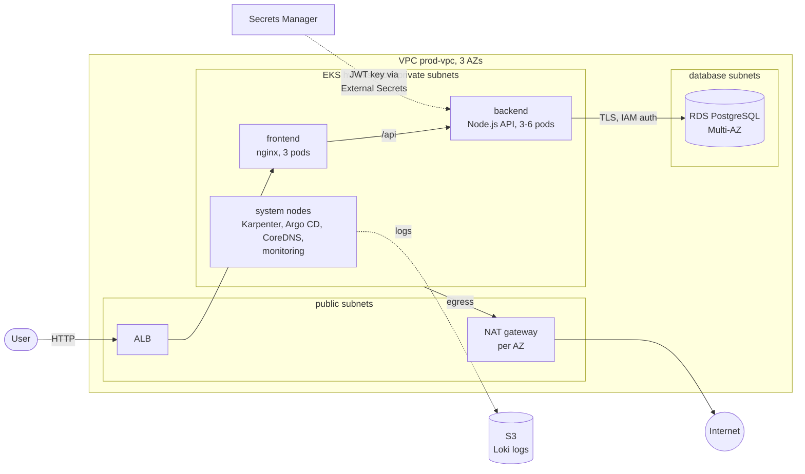
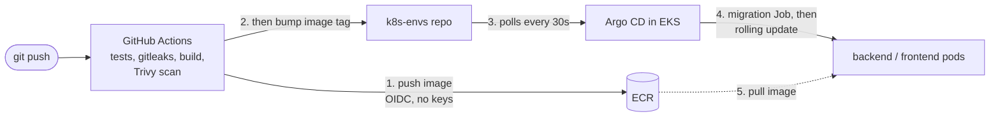

# Conduit on AWS: infrastructure

Production-style AWS platform for the [RealWorld "Conduit"](https://github.com/jelicki-jovan/Incode-conduit-realworld-example-app)
app (React frontend, Node.js/Express API, PostgreSQL): EKS, RDS, GitOps with Argo CD, all AWS resources
defined in Terraform. Built as the Incode DevOps take-home task.

## At a glance

| Area | What |
|---|---|
| Compute | EKS 1.36 in 3 AZs; managed **system** node group for cluster add-ons + **Karpenter** for app nodes (spot + on-demand) |
| Data | RDS PostgreSQL 17, Multi-AZ, encrypted, TLS enforced; the app logs in with **IAM auth** (no DB password) |
| Delivery | GitHub Actions (tests, secret scan, image scan) → ECR → **Argo CD** (GitOps) |
| Security | No long-lived AWS keys (GitHub OIDC, IRSA, Pod Identity), app logs in to the DB without a password, secrets in Secrets Manager + External Secrets (never in Git), private subnets, least-privilege roles |
| Observability | Prometheus + Grafana, Loki (logs in S3), CloudWatch; alerts to email via SNS, incl. a dead man's switch |
| Backups | RDS point-in-time restore (7 days), daily EBS snapshots (DLM), S3 versioning |
| IaC | Terraform, remote state in S3 with native locking, one stack per account level / environment |

## Architecture

- A request hits the **ALB** (created by the AWS Load Balancer Controller from the frontend's Ingress), which
  sends it straight to the **frontend** pods (nginx serving the React build). nginx proxies `/api/*` to the
  **backend** Service inside the cluster; the backend has no public entry point of its own.
- The backend talks to **RDS** over verified TLS, as a least-privilege `app_user`, with a 15-minute IAM token
  from its pod's IAM role instead of a password.
- **Nodes**: a small managed node group (tainted, system add-ons only) keeps the cluster itself running;
  **Karpenter** launches app nodes on demand, mixing spot and on-demand, spread over 3 AZs.
- **Network**: public subnets only for the ALB and NAT gateways; nodes in private subnets; RDS in isolated
  database subnets reachable only from the EKS nodes. One NAT gateway per AZ (an AZ outage doesn't cut egress).

## How the three repositories fit together

| Repository | Owns |
|---|---|
| [`Incode-conduit-realworld-example-app`](https://github.com/jelicki-jovan/Incode-conduit-realworld-example-app) | App code, Dockerfiles, CI (GitHub Actions) |
| **`terraform`** (this repo) | Everything in AWS + the cluster bootstrap (Karpenter, Argo CD) |
| [`k8s-envs`](https://github.com/jelicki-jovan/k8s-envs) | Everything inside the cluster, synced by Argo CD (apps, add-ons, monitoring) |

CI never gets cluster credentials: it pushes the image and, only once that succeeded, commits the new tag to
`k8s-envs` (so Argo CD never sees a tag whose image doesn't exist yet). Argo CD
pulls the change and rolls it out (database migrations first, as a Job, then a zero-downtime rolling update).

## What's in this repo

| Folder | What | Details |
|---|---|---|
| `management/` | Account-level, shared by all environments: Terraform state bucket, ECR repositories, GitHub OIDC role for CI, EC2 Spot service-linked role | [README](management/README.md) |
| `environments/prod/` | The prod environment, one file per component: VPC, EKS, RDS, backend, frontend, monitoring | [README](environments/prod/README.md) |
| `environments/prod/platform/` | What runs on the cluster and bootstraps it: Karpenter, Argo CD | [README](environments/prod/platform/README.md) |
| `modules/` | Own modules (S3, ECR) with secure defaults | [README](modules/README.md) |
| `docs/` | Decisions, known gaps, runbooks | [known gaps](docs/known-gaps.md), [runbooks](docs/runbooks/) |

## Setup from zero

Prerequisites: an AWS account (region **us-east-1**: the account's SCPs allow no other region), Terraform
≥ 1.10, AWS CLI v2, kubectl.

1. **`management/`**: first apply with local state (the state bucket doesn't exist yet), then enable the S3
   backend and `terraform init -migrate-state`. Creates the state bucket, ECR repositories and the GitHub
   OIDC role.
2. **App repo CI**: set the role ARN (output `github_actions_ecr_role_arn`) and the deploy key for
   `k8s-envs` in the app repo's GitHub Actions settings.
3. **`environments/prod/`**: `terraform init && terraform apply`. Creates the VPC, EKS, RDS, secrets, IAM
   roles and monitoring storage, then installs Karpenter and Argo CD. Argo CD syncs `k8s-envs` and brings up
   everything else (add-ons, monitoring, the apps).
4. **Second `terraform apply`** once Argo CD has created the ALB: adds the ALB alarms (the ALB is created by
   Kubernetes, not Terraform).
5. **Alerts**: subscribe an email to the SNS topic `hw-alerts-prod` and confirm it (kept out of the code on
   purpose: no personal address in a public repo).

Access: `aws eks update-kubeconfig --name hw-eks-prod --region us-east-1`; Argo CD and Grafana are reached
with `kubectl port-forward` (no public UIs). Step-by-step details are in the folder READMEs.

Rebuilding in another account needs a few values changed: the EKS admin (access entry), the account ID and
role ARNs referenced in `k8s-envs`, and the RDS endpoint/secret name.

## Key decisions

- **GitOps with separate repos**: app, infrastructure and cluster state are versioned and reviewed
  separately; CI has no cluster access. Trade-off: a deploy is two commits (image + tag bump).
- **System node group + Karpenter**: the cluster's own add-ons never depend on nodes Karpenter creates;
  apps get fast, cheap scaling with spot, while spread rules keep ≥ 1 replica per AZ and on on-demand.
- **As few long-lived credentials as possible**: no AWS keys anywhere (IRSA/Pod Identity for pods, OIDC for
  CI), no database password for the app (IAM auth). The secrets that remain (JWT signing key, RDS master
  password used only by migrations, the CI deploy key for `k8s-envs`) live in Secrets Manager or as an
  encrypted GitHub Actions secret, never in Git or in Terraform state.
- **Self-hosted monitoring** (Prometheus, Grafana, Loki) instead of the managed services: Amazon Managed
  Grafana needs IAM Identity Center, which this account doesn't have. CloudWatch still covers the AWS side
  and alerts that must work even if the cluster is down.
- **Built within the account's guardrails**: one region, small instance types only, no AWS Backup →
  backups with RDS automated backups + Data Lifecycle Manager instead.

More in [docs/decisions.md](docs/decisions.md).

## Known gaps

- Terraform is applied from a laptop; production would run plan/apply from a pipeline with approvals.
- No domain: HTTP only, no HTTPS/ACM, Argo CD and Grafana only via port-forward.
- EKS API endpoint is public (IAM-authenticated); production: private endpoint + VPN.
- No network policies between pods yet (enforcement is enabled, no policies written).
- Backend has no request logging or application metrics (infrastructure-level monitoring only).

Full list: [docs/known-gaps.md](docs/known-gaps.md).

## Runbooks

- [Restore the database](docs/runbooks/restore-db.md)
- [Tear everything down](docs/runbooks/teardown.md)
- [Debugging an incident](docs/runbooks/incident-debugging.md)
